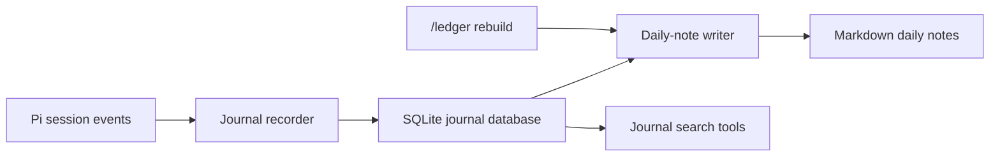
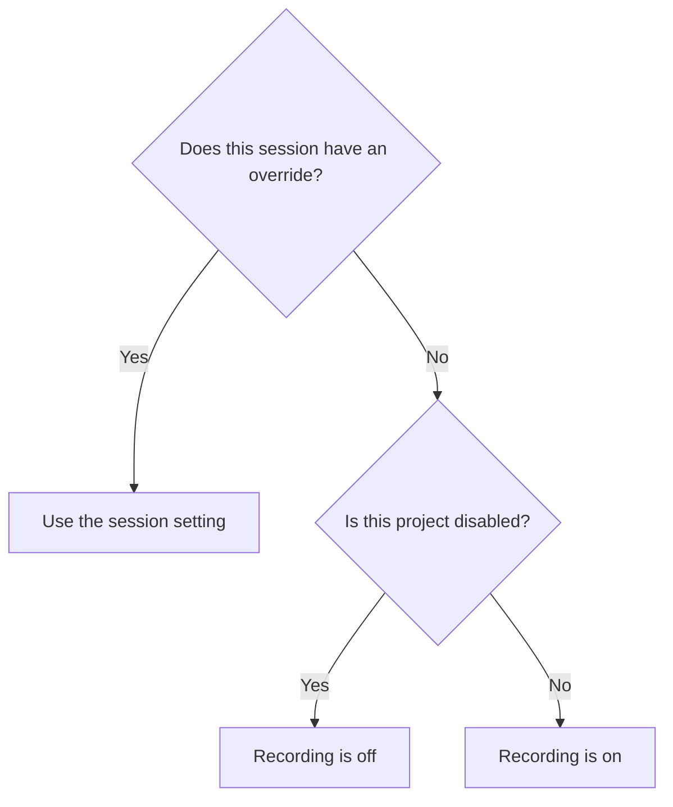

# How pi-ledger works

pi-ledger records facts about work that you ask Pi to do. It does not store assistant response text. It does not use a model to create journal entries.

This guide uses these terms:

- A **journal entry** is one recorded user request and its usage facts.
- The **journal database** is the SQLite file that stores all journal data.
- A **daily note** is a Markdown file that pi-ledger creates from the database.

The database is authoritative. Daily notes are derived files. You can rebuild them from the database at any time.

## System flow

The extension listens to Pi session events. The recorder converts these events into journal facts. The database stores the facts. The note writer and search tools read from the database.

## How pi-ledger records a request

1. Pi starts work on a user request.
2. pi-ledger receives the expanded request from `before_agent_start`. This text can include the result of a skill or prompt-template expansion.
3. Pi creates the user message in the session. pi-ledger stores a pending journal entry for that message.
4. Pi writes assistant messages and tool results to the session.
5. When the agent settles, pi-ledger collects model and tool facts for the request.
6. pi-ledger changes the entry state to `settled` and marks its local date as dirty.
7. The note writer regenerates the daily note for each dirty date.

A journal entry can have one of these states:

| State         | Meaning                                                                 |
| ------------- | ----------------------------------------------------------------------- |
| `pending`     | Pi started the request, but pi-ledger has not recorded its final facts. |
| `settled`     | Pi finished the request and pi-ledger recorded its facts.               |
| `interrupted` | The session stopped before the request settled.                         |

A reload does not interrupt pending entries. When the session starts again, pi-ledger examines the visible branch and settles any complete entries. A final shutdown marks the remaining pending entries as interrupted.

## How recording controls work

Recording is on by default. A session setting has priority over a project setting.

The rules have this order:

1. `/ledger on` or `/ledger off` sets the state for the current session.
2. If there is no session setting, the exact working directory controls the project state.
3. If there is no project exclusion, recording is on.

Session settings are hidden Pi session entries. They survive reloads and resumes. Project exclusions are rows in the journal database. They apply to future sessions that use the same working directory.

Disabling recording does not disable search or note rebuilding.

## What the database stores

The database is at `~/.pi/agent/ledger/ledger.sqlite` by default. If Pi uses a custom agent directory, pi-ledger uses that directory.

| Data               | Purpose                                                                    |
| ------------------ | -------------------------------------------------------------------------- |
| Journal entries    | Store requests, times, project paths, session links, and entry states.     |
| Model facts        | Store response counts, token usage, and costs for each provider and model. |
| Tool facts         | Store execution counts, failures, token usage, and costs for each tool.    |
| Full-text index    | Search recorded request text.                                              |
| Dirty dates        | Track daily notes that need regeneration.                                  |
| Project exclusions | Store projects for which recording is off.                                 |

The database uses foreign keys and write-ahead logging. Schema migrations run in transactions. pi-ledger rejects a database with a schema version that is newer than the version it supports.

## How daily notes stay consistent

Daily notes are at `~/.pi/agent/ledger/notes/YYYY-MM-DD.md` by default.

When an entry changes, pi-ledger increases the revision for its local date. The note writer reads the current revision and writes a complete note for that date. It clears the dirty state only if the revision did not change during the write.

The writer uses a lock file to prevent two processes from writing the same note at the same time. It writes to a temporary file and then renames that file. This operation prevents a partial note from replacing a valid note.

`/ledger rebuild` marks every date as dirty and regenerates all daily notes. It does not change the journal entries.

## How search works

`journal_search` searches only request text. It does not search assistant responses.

The search process is:

1. Convert words and quoted phrases into a safe SQLite full-text query.
2. Search for entries that contain every term.
3. If there are no results, search for entries that contain any term.
4. Rank the results with SQLite BM25 ranking.
5. Apply the requested date, project, model, and tool filters.

The full-text index uses Unicode tokenization and Porter stemming. A search can therefore match common forms of the same English word.

`journal_related` starts with one journal entry. It selects up to six frequent topic words from that request and ignores short and common words. It searches for entries containing any of those terms, excludes the source entry, and uses BM25 to rank stronger overlaps first.

Related search is lexical. It finds shared words and word forms. It does not use embeddings or a model, so it does not always match different words that have the same meaning.

## Failure behaviour

Journal work must not stop a Pi session.

- If the database cannot open, pi-ledger stops recording for that runtime and shows one warning.
- If entry recording fails, pi-ledger shows one warning and lets Pi continue.
- If note generation fails, the date stays dirty. A later regeneration can repair the note.
- If Pi or the extension stops during a request, the pending database row remains available for recovery.

## Privacy boundary

pi-ledger writes journal data only to the local Pi agent directory. It does not send journal data to a service or model.

The journal stores request text and usage facts. It does not copy assistant responses or tool-result content. The original Pi session remains the source for the complete transcript.

On systems with POSIX permissions, pi-ledger sets journal directories to `0700` and journal files to `0600`.

## Code map

| File                        | Responsibility                                           |
| --------------------------- | -------------------------------------------------------- |
| `src/extension.ts`          | Connect Pi events, tools, commands, and status messages. |
| `src/journal/recorder.ts`   | Convert session entries into journal facts.              |
| `src/journal/database.ts`   | Store, query, and retrieve journal data.                 |
| `src/journal/schema.ts`     | Create and migrate the SQLite schema.                    |
| `src/journal/daily-note.ts` | Render and safely write Markdown notes.                  |
| `src/journal/paths.ts`      | Resolve the journal storage paths.                       |
